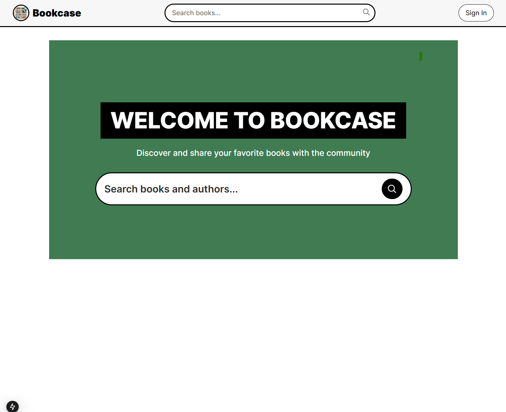
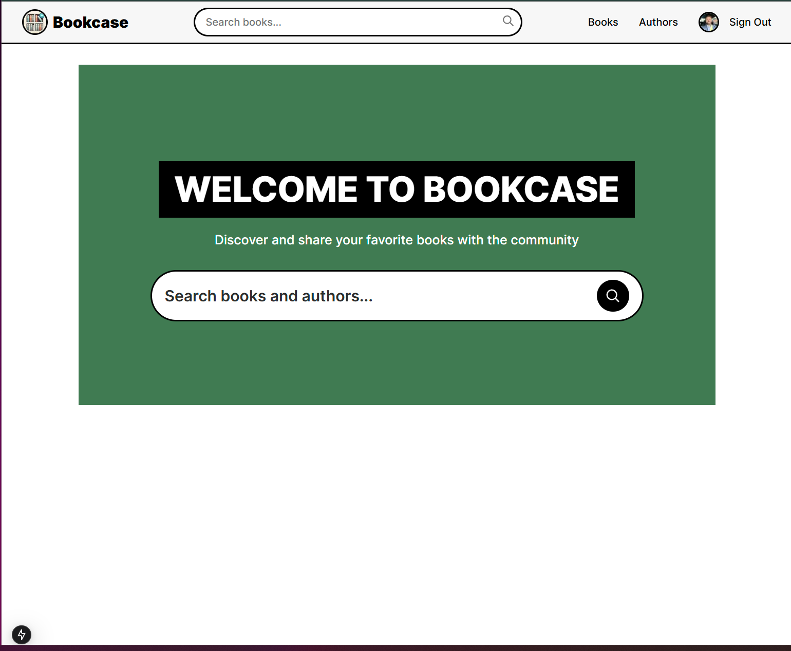

# 📚 Bookcase

A modern web application for managing and discovering books and authors. Built with Next.js 15+, Firebase, and Tailwind CSS.

## 🌟 Features

- **Authentication**: Secure Google Sign-In
- **Book Management**: Add, edit, and delete books
- **Author Management**: Manage author profiles
- **Search Functionality**:
  - Search books by title and description
  - Search authors by name and email
  - Unified search across books and authors
- **Responsive Design**: Works seamlessly on desktop and mobile
- **Real-time Updates**: Instant reflection of changes
- **Image Handling**: Support for book covers and author avatars

## 📸 Screenshots





## 🛠️ Technical Stack

- **Frontend**:
  - Next.js 15+ (App Router)
  - React 19
  - TypeScript
  - Tailwind CSS
  - Firebase Auth

- **Backend**:
  - Next.js API Routes
  - Firebase Admin SDK
  - Firestore Database

- **Development Tools**:
  - ESLint
  - Prettier
  - Git

## 🚀 Getting Started

1. **Clone the repository**
   ```bash
   git clone https://github.com/omerakben/simply-bookcase.git
   cd simply-bookcase
   ```

2. **Install dependencies**
   ```bash
   npm install
   ```

3. **Set up environment variables**
   Create a `.env` file in the root directory:
   ```env
   NEXT_PUBLIC_FIREBASE_API_KEY=your_api_key
   NEXT_PUBLIC_FIREBASE_AUTH_DOMAIN=your_auth_domain
   NEXT_PUBLIC_FIREBASE_PROJECT_ID=your_project_id
   NEXT_PUBLIC_FIREBASE_STORAGE_BUCKET=your_storage_bucket
   NEXT_PUBLIC_FIREBASE_MESSAGING_SENDER_ID=your_messaging_sender_id
   NEXT_PUBLIC_FIREBASE_APP_ID=your_app_id
   FIREBASE_CLIENT_EMAIL=your_client_email
   FIREBASE_PRIVATE_KEY=your_private_key
   ```

4. **Run the development server**
   ```bash
   npm run dev
   ```

5. **Open your browser**
   Navigate to [http://localhost:3000](http://localhost:3000)

## 📁 Project Structure

```
simply-bookcase/
├── app/
│   ├── api/           # API routes
│   ├── components/    # Reusable components
│   ├── lib/          # Utilities and configurations
│   └── [routes]/     # Application pages
├── public/           # Static assets
└── types/           # TypeScript type definitions
```

## 🔑 Key Features Implementation

### Authentication
- Google Sign-In integration
- Protected routes and API endpoints
- User session management

### Search Functionality
- Real-time search results
- Unified search across multiple collections
- Type-safe search implementation

### Data Management
- CRUD operations for books and authors
- Image URL validation and fallbacks
- Proper error handling and loading states

## 🤝 Contributing

1. Fork the repository
2. Create your feature branch (`git checkout -b feature/AmazingFeature`)
3. Commit your changes (`git commit -m 'Add some AmazingFeature'`)
4. Push to the branch (`git push origin feature/AmazingFeature`)
5. Open a Pull Request

## 👥 Contributors

- [Omer(OZZY) Akben](https://github.com/omerakben) - Initial work & maintenance

## 🙏 Acknowledgments

### Core Technologies
- [Next.js](https://nextjs.org/)
- [Firebase](https://firebase.google.com/)
- [Tailwind CSS](https://tailwindcss.com/)
- [React Icons](https://react-icons.github.io/react-icons/)

### Special Thanks
- [Adrian Hajdin](https://github.com/adrianhajdin) - For inspiration and best practices in modern web development
- [JavaScript Mastery](https://github.com/adrianhajdin/yc_directory) - For excellent examples of clean architecture and UI design patterns
